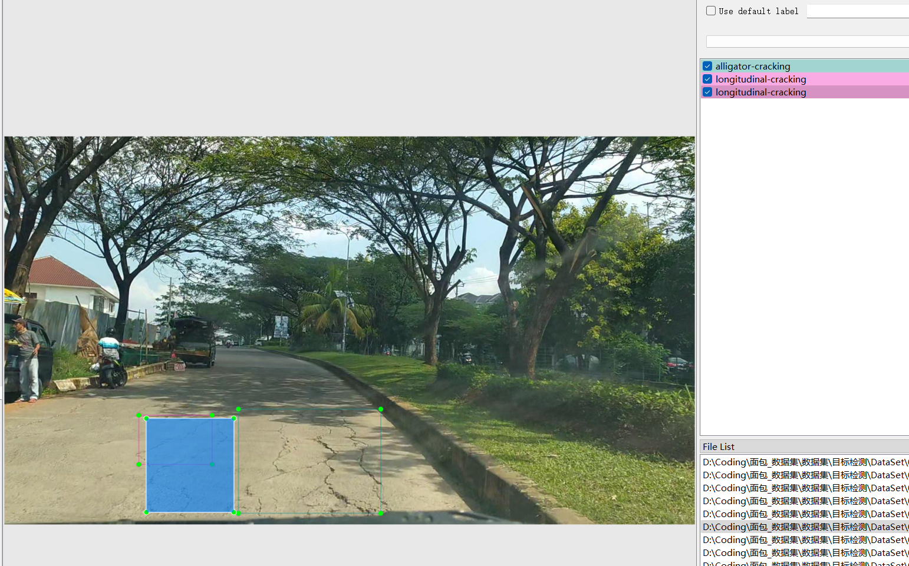

# Road Detection - Object Detection Dataset

Dataset Information Explanation: This dataset consists of a total of 3,321 images and corresponding annotation files. The annotation files are available in two formats: VOC-XML and YOLO-TXT. The annotated objects include the following:
- Lateral Cracking
- Longitudinal Cracking
- Alligator Cracking
- Pothole

The number of annotation boxes for each object is as follows:
- Lateral Cracking: 1,222 (Lateral cracking)
- Longitudinal Cracking: 2,156 (Longitudinal cracking)
- Alligator Cracking: 964 (Alligator cracking)
- Pothole: 2,657 (Pothole)

Note that an image may contain multiple objects, so the total number of annotation boxes might exceed the number of images.

The complete dataset consists of three folders and one txt file:
- all_images folder: Stores the dataset's images, screenshots included.
- Image size information:
- all_txt folder and classes.txt: Stores the YOLO-TXT annotation files, with the number of files equal to the number of images. Each annotation file is paired with an image.
- classes.txt:
- For a detailed understanding of the standard YOLO-TXT file, please search for it yourself on Baidu. Simply put, the number 0 represents the name of the object at the array index 0 in classes.txt.
- all_xml folder: VOC-XML annotation file, with the number of files equal to the number of images.
- For a detailed understanding of the standard VOC-XML file, please search for it yourself on Baidu.
- Both formats of annotation are usable; choose whichever one you prefer.
Annotation effect screenshots:

## Images

Here is a pay link on Stripe ( https://buy.stripe.com/3cs8yP7sY87d0vu9AB ). Please contact me lonlonago@foxmail.com after funding $89, and I will send you a complete data files , thank you!

